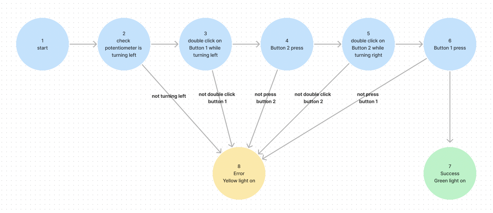
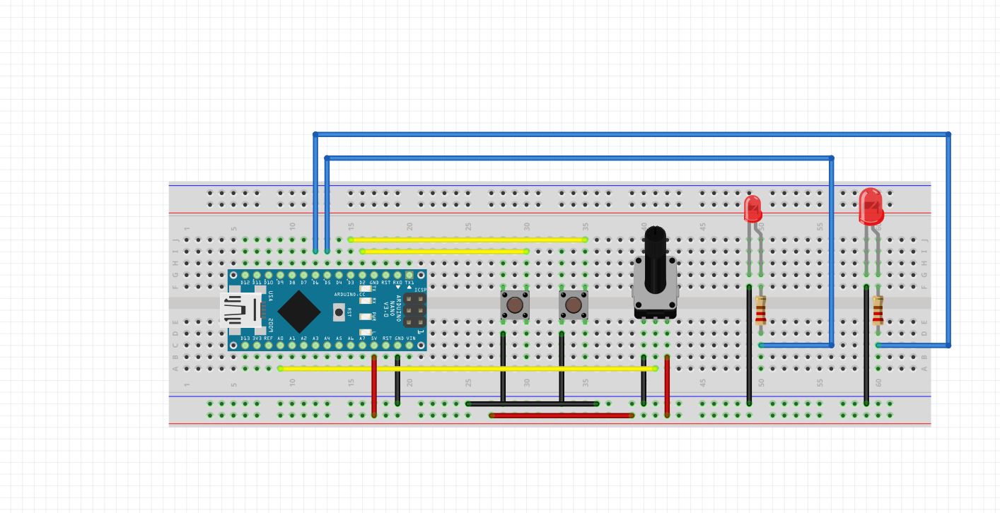

# HW11
## Summary
This code involves a potentiometer (an analog input), two buttons, and two LEDs.The code implements a finite state machine (FSM) to control the behavior of the system based on the readings from these inputs. 

## Process
Here is the FSM Drawing.

Here is the schematic drawing of my circuit.

## Logic and Steps
FSM:
   - Implements a finite state machine with five states (0 to 4) and a success state.
   - Transitions between states based on potentiometer readings and button presses.
   - Displays success by flashing the green LED in a specific pattern.
   - Displays failure by turning on the yellow LED for a second and printing "mission failed" to the Serial Monitor.
States:
   - State -1: Initial state, checks if the user is turning the potentiometer left.
   - State 0: Checks for a double click on Button 1 while turning left.
   - State 1: Checks for potentiometer value and Button 2 press.
   - State 2: Checks for a double click on Button 2 while turning right.
   - State 3: Checks for potentiometer value and Button 1 press.
   - State 4: Success state, flashes the green LED.
   - Failure: Yellow LED turns on for a second if failure conditions are met in any state.
Steps to Success:
1. Turning Left
2. Double Click Button 1 while turning left
3. Pot Value <= 10 and Button 2 Pressed
4. Turning Right while Double Click Button 2
5. Pot Value >= 4090 and Button 1 Pressed

